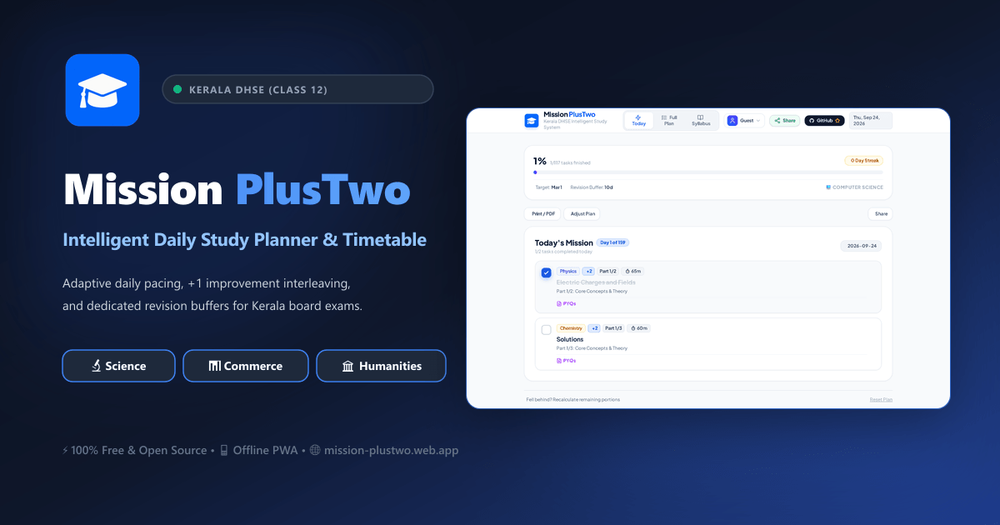
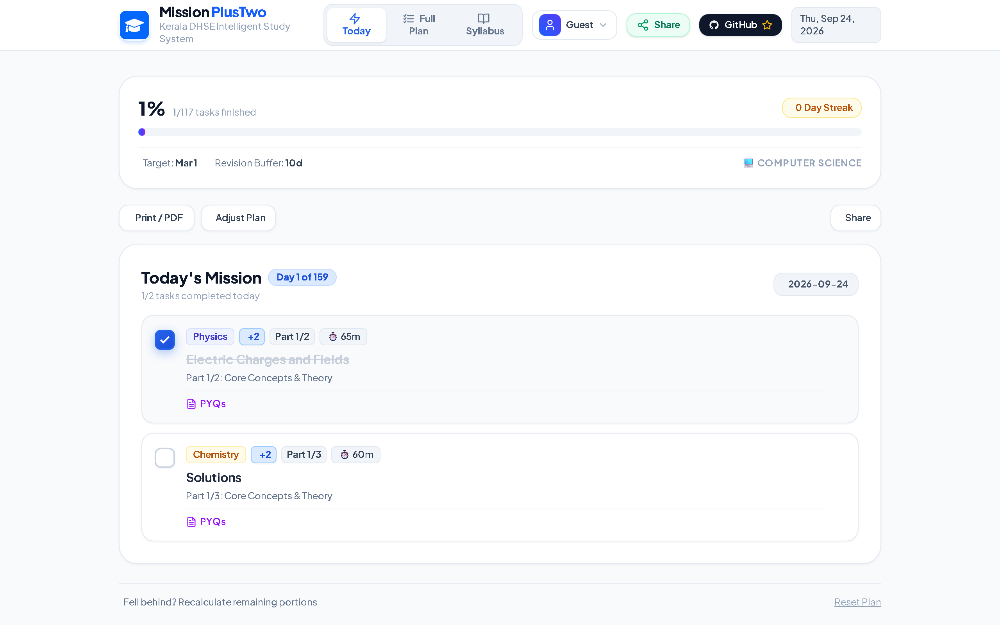
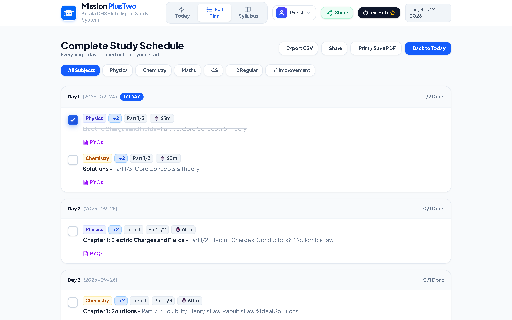
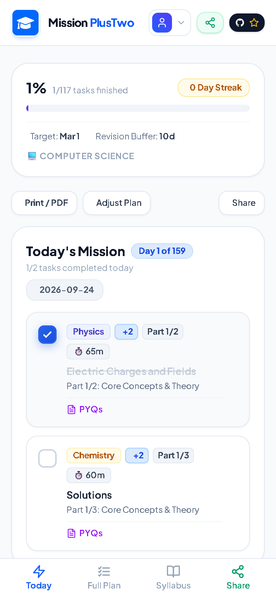
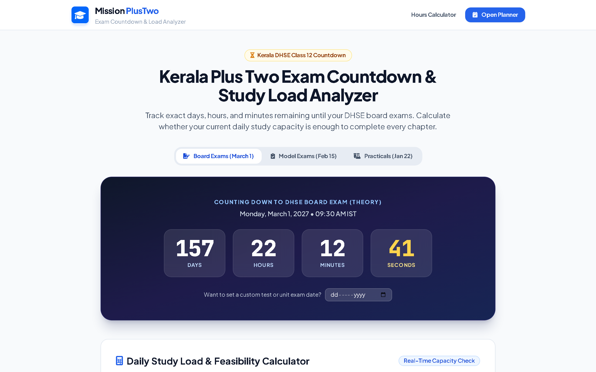

<div align="center">


# 🎓 Mission PlusTwo
### 🚀 The Intelligent Daily Study Revision Engine for Kerala Higher Secondary (+2) Candidates

[](https://github.com/sreyasts/intelligent-study-planner-for-plus-two-/actions)
[](LICENSE)
[](https://mission-plustwo.web.app/)
[](CONTRIBUTING.md)
[](data/kerala-dhse/)
[](https://github.com/sreyasts/intelligent-study-planner-for-plus-two-)

<br/>

## 🌐 👉 [**LAUNCH MISSION PLUSTWO (WEB APP)**](https://mission-plustwo.web.app/) 👈
*100% Free, Zero-Cost Civic Software • Works Offline in any browser on Phone, Tablet, or PC • No Ads, Zero PII Tracking*

<br/>

<a href="https://mission-plustwo.web.app/">
  
</a>

</div>

---

## 🏛️ Mission & Civic Impact Statement

Over **350,000 students** appear annually for the Kerala Directorate of Higher Secondary Education (DHSE) Class 12 board examinations. The vast majority study in government and aided higher secondary schools across rural and semi-urban panchayats in Kerala. Commercial coaching packages and proprietary test-prep apps cost thousands of rupees per year—creating an acute digital and economic divide for candidates from low-income families.

**Mission PlusTwo** was created as an uncompromising public good:
- **100% Free and Open-Source**: Zero subscription walls, zero microtransactions, zero sponsored content.
- **Privacy-First & DPDP Act 2023 Compliant**: Operates by default in 100% client-side Guest Mode using browser `localStorage`. No student names, phone numbers, or academic records are collected or sold.
- **Low-Bandwidth Rural Resilience**: Designed as an **Offline-First Progressive Web App (PWA)** with service worker asset caching. Once loaded, students can generate schedules, track completed chapters, review formulas, and print timetables with zero active internet connection during power outages or limited 2G/3G rural cellular coverage.
- **Pedagogical Empathy**: Rather than static, demoralizing PDF timetables downloaded from Telegram channels, Mission PlusTwo provides an adaptive constraint-satisfaction scheduler that spaces cognitive load evenly, weaves active recall, and recovers smoothly when a student falls sick or misses a day.

---

## 📸 Interface & User Experience

| 🖥️ Desktop Daily Study Dashboard | 📅 Complete Interleaved Timetable & QR |
| :---: | :---: |
|  |  |

| 📱 Mobile Study Experience | ⏳ DHSE Board Exam Countdown & Load Analyzer |
| :---: | :---: |
|  |  |

---

## ⚙️ System Architecture & Algorithms

Mission PlusTwo is structured as a decoupled, multi-tier software architecture:

```
intelligent-study-planner-for-plus-two/
├── data/kerala-dhse/            # Machine-readable curriculum JSON specifications
│   ├── science.json             # Physics, Chemistry, Math, Biology, CS
│   ├── commerce.json            # Accountancy, Business Studies, Economics, CA
│   └── humanities.json          # History, Political Science, Sociology, Economics
├── schemas/                     # Rigid JSON Schemas validating curriculum data
│   └── curriculum.schema.json   # Draft-07 schema for subjects, chapters & weightages
├── src/
│   ├── core/                    # Framework-agnostic pure scheduling engine
│   │   ├── scheduler.js         # Deterministic timetable & active recall allocation
│   │   └── index.js             # Reusable core entry point
│   ├── engine/                  # Legacy planner adapter & migration bridges
│   ├── audio/                   # 0.6 KB WebAudio synthesizer for sensory feedback
│   ├── i18n/                    # Malayalam (മലയാളം) & English bilingual localization
│   ├── utils/qr.js              # Offline vector SVG QR code generator
│   └── app.js                   # Reactive UI controller & PWA lifecycle
└── tests/                       # Vitest suites & 550+ engine invariant checks
```

### 1. The Core Scheduling Algorithm (`src/core/scheduler.js`)
The scheduling engine solves an academic constraint satisfaction problem in deterministic $O(N \log N + D \cdot S)$ time:
1. **Capacity Accumulator**: Computes daily study capacity based on student hours, weekday/weekend balance, and weekly rest rhythm.
2. **Topological Part Dependency**: Enforces that for any chapter with multiple parts (e.g. *Part 1: Concept*, *Part 2: Derivations & Numericals*), Part $N$ is strictly scheduled on or before Part $N+1$.
3. **Multi-Subject Interleaving**: Prevents mental burnout by rotating across subjects daily using a balanced scoring heuristic ($w \cdot 1.2 + \text{inProgBonus} + \text{recencyGap} \cdot 0.8$) rather than single-subject cramming.
4. **Dynamic Active Recall Runway**: Automatically reserves 1 to 10 days immediately before the target examination date dedicated exclusively to:
   - High-yield Previous Year Questions (PYQs)
   - Timed 3-hour Model Exam simulations under board conditions
   - Formula sheet and circuit diagram retrieval sessions
5. **Class 11 (+1) Improvement Weaving**: Prioritizes pending Class 11 improvement papers before their specific milestone exam dates while keeping Class 12 studies on track.

### 2. Standalone Core Engine Usage (For External Developers & Other Boards)
The core scheduling engine under `src/core/` is 100% decoupled from the DOM and web framework. External developers, researchers, or regional education boards (e.g., CBSE, ICSE, Tamil Nadu, Karnataka State Board) can import and use it in Node.js, React Native, or backend APIs:

```javascript
import { generateSchedule, validateSchedule } from './src/core/index.js';

// Generate a deterministic study schedule for any student
const schedule = generateSchedule({
  stream: 'science',
  examDate: '2027-03-01',
  startDate: '2026-10-01',
  subjects: ['Physics', 'Chemistry', 'Mathematics', 'Computer Science'],
  hoursPerDay: 3.5,
  focusAreas: ['Physics'], // Subtle +15% focus nudge
  weeklyRhythm: 'weekend_booster',
});

// Verify plan validity across all academic invariants
const check = validateSchedule(schedule);
console.log(`Plan valid: ${check.isValid}, Total Days: ${schedule.plan.length}`);
```

---

## 📊 Standardized Curriculum Schemas

All curriculum data is codified into open, standardized JSON formats under `data/kerala-dhse/` strictly validated against [`schemas/curriculum.schema.json`](schemas/curriculum.schema.json).

### Contributing New Syllabus Blueprints
To add or update chapter marks or revision hours:
1. Edit the relevant stream file (`data/kerala-dhse/science.json`, `commerce.json`, or `humanities.json`).
2. Adhere to the schema specification:
   ```json
   {
     "subjectId": "physics-plus-two",
     "subjectName": "Physics",
     "stream": "science",
     "grade": 12,
     "chapters": [
       {
         "chapterNumber": 1,
         "title": "Electric Charges and Fields",
         "weightageScore": 6,
         "recommendedRevisionHours": 4.5,
         "term": 1,
         "effort": "HIGH"
       }
     ]
   }
   ```
3. Run the automated schema validation test:
   ```bash
   npx vitest run tests/curriculum-schema.test.js
   ```

---

## 🛠️ Local Development & Contribution

### Prerequisites
- **Node.js**: v18.0.0 or later (v20+ LTS recommended)
- **npm**: v9.0.0 or later
- **Git**

### Quick Start
```bash
# 1. Clone the repository
git clone https://github.com/sreyasts/intelligent-study-planner-for-plus-two-.git
cd intelligent-study-planner-for-plus-two-

# 2. Install dependencies
npm install

# 3. Start local development server
npm run dev

# 4. Open in browser
# http://localhost:5173
```

### Running Automated Tests
```bash
# Run all Vitest unit and integration test suites (68+ tests)
npm test

# Run legacy invariant test suite (550+ checks)
npm run test:legacy

# Run code linter
npm run lint

# Build production bundle and verify static assets
npm run build
```

---

## 📋 Community, Governance & Transparency

- **[Project Maintainers & 48h SLA](MAINTAINERS.md)**: Maintainer identity (Sreyas T S), review commitments, and project invariants.
- **[Project Governance](GOVERNANCE.md)**: Decision-making model, RFC process, and release policies.
- **[Public Audit & Usage Statistics](https://mission-plustwo.web.app/pages/stats.html)**: Public telemetry, 0-fake commitment, and test scorecards.
- **[Contributor Outreach & Good First Issues](docs/contributor-outreach.md)**: Ready-to-claim beginner issues and Malayalam tech community outreach.
- **[Codex Readiness Scorecard (Draft)](docs/CODEX-READINESS-SCORECARD.md)**: 60/90-day review thresholds and draft application.
- **[Contributing Guidelines](CONTRIBUTING.md)**: Local setup, Conventional Commits, branch workflows, and curriculum updates.
- **[Code of Conduct](CODE_OF_CONDUCT.md)**: Contributor Covenant v2.1.
- **[Security & Privacy Policy](SECURITY.md)**: Responsible disclosure instructions and DPDP Act 2023 compliance.
- **[Changelog](CHANGELOG.md)**: Keep a Changelog releases and history.
- **[Algorithm Specification](docs/ALGORITHM.md)**: Formal mathematical pacing specification.
- **[Empirical Benchmarks](docs/BENCHMARKS.md)**: Comparative benchmarks against sequential and round-robin baselines.

---

## 📄 License

This project is licensed under the OSI-approved [MIT License](LICENSE) &copy; 2026 Sreyas T S & Mission PlusTwo Contributors. Free to use, adapt, and build upon for educational equity.
