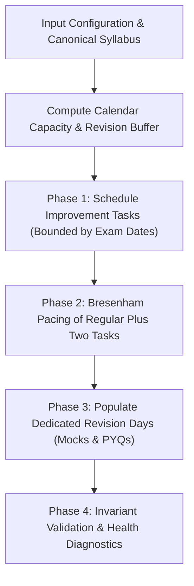

# Mission PlusTwo — Planning Algorithm Specification

## 1. Algorithmic Overview

Mission PlusTwo employs a **deterministic, constraint-aware scheduling algorithm** that solves the multi-subject academic timetable allocation problem under rigid board examination deadlines, subject dependencies, and varying daily capacities.

Rather than relying on non-deterministic or compute-heavy stochastic heuristics (e.g. simulated annealing or unconstrained LLM text generation), the algorithm executes in guaranteed polynomial time (\(O(N \log N + D \cdot S)\) where \(N\) is syllabus parts, \(D\) is runway days, and \(S\) is stream subjects) and ensures **100% reproducible schedules** given identical inputs.

---

## 2. Formal Inputs & Constraints

### 2.1 Inputs & Configuration Vector
The planner accepts configuration tuple \(\mathcal{C} = \langle t_0, t_{\text{deadline}}, \mathcal{S}, \mathcal{T}, \mathcal{I}, \mathcal{R}_{\text{weekly}}, \mathcal{W}_{\text{subject}}, d_{\text{hours}} \rangle\):

* \(t_0 \in \text{YYYY-MM-DD}\): Schedule start date.
* \(t_{\text{deadline}} \in \text{YYYY-MM-DD}\): Final examination deadline date.
* \(\mathcal{S} \in \{\text{cs}, \text{bio}, \text{imp\_only}\}\): Active subject domain:
  - Computer Science: \(\{\text{Physics}, \text{Chemistry}, \text{Mathematics}, \text{Computer Science}\}\)
  - Biology: \(\{\text{Physics}, \text{Chemistry}, \text{Mathematics}, \text{Botany}, \text{Zoology}\}\)
* \(\mathcal{T} \in \{1, 2, 3\}\): Term scope filter (Term 1 Onam, Term 2 Christmas, Term 3 Model/Board Exam).
* \(\mathcal{I} = \{(s_k, t_k^{\text{exam}})\}_{k=1}^m\): Improvement exam tuples where \(s_k \in \mathcal{S}\) and \(t_k^{\text{exam}} \le t_{\text{deadline}}\).
* \(\mathcal{R}_{\text{weekly}} \in \{\text{standard}, \text{weekend\_booster}\}\): Weekly pacing distribution.
* \(\mathcal{W}_{\text{subject}}: S \to \mathbb{R}^+\): Subject-specific difficulty weights (e.g. \(1.35\) for focus subjects).
* \(d_{\text{hours}} \in [1, 10]\): Target daily study hours.

### 2.2 Invariant Constraints

1. **Topological Order Invariance**: For any chapter \(C\) with parts \(p_1, p_2, \dots, p_k\), scheduled day \(d(p_{j+1}) \ge d(p_j)\).
2. **Improvement Deadline Invariance**: For every \(+1\) task \(t\) in improvement subject \(s_k\), \(d(t) \le t_k^{\text{exam}}\).
3. **Task Coverage & Non-Duplication**: \(\sum_{d \in D} |t \in d| = N_{\text{applicable}}\) with \(\text{duplicates} = 0\) and \(\text{omitted} = 0\).
4. **Revision Buffer Preservation**: Final \(R\) days of the schedule (\(1 \le R \le 10\)) are reserved exclusively for mock papers, previous-year question (PYQ) sprints, and formula recall.
5. **Rest Day Capacity**: On user-designated rest days \(d_{\text{rest}}\), no active syllabus study is allocated.

---

## 3. Step-by-Step Scheduling Strategy

### Step 1: Runway Calculation & Dynamic Revision Sizing

Runway length is computed:
\[
D_{\text{total}} = \text{calculateDaysBetween}(t_0, t_{\text{deadline}}) + 1
\]
The dedicated revision buffer \(R\) is dynamically partitioned according to runway duration:
\[
R = \begin{cases}
10 & \text{if } D_{\text{total}} \ge 75 \\
7 & \text{if } 45 \le D_{\text{total}} < 75 \\
4 & \text{if } 25 \le D_{\text{total}} < 45 \\
2 & \text{if } 14 \le D_{\text{total}} < 25 \\
1 & \text{if } 7 \le D_{\text{total}} < 14 \\
0 & \text{if } D_{\text{total}} \le 5
\end{cases}
\]
Active syllabus study days: \(D_{\text{syllabus}} = \max(1, D_{\text{total}} - R)\).

---

### Step 2: Phase 1 — Plus One (+1) Improvement Schedulability

Because \(+1\) improvement exams typically occur midway through the Plus Two academic year, improvement tasks must be back-loaded and completed *strictly prior* to each subject's exam date:

1. For each subject \(s \in \mathcal{I}\), filter all corresponding Class 11 parts: \(\{t_1, t_2, \dots, t_m\}\).
2. Calculate the latest safe study date:
   \[
   d_{\text{latest}} = \max(0, \min(d_{\text{exam}} - 2, D_{\text{syllabus}} - 1))
   \]
3. Gather available active non-rest study days \([0, d_{\text{latest}}]\).
4. Map part index \(j \in [0, m-1]\) uniformly across available slots:
   \[
   \text{targetDay}(j) = \text{availableDays}\left[\left\lfloor \frac{j}{m} \cdot |\text{availableDays}| \right\rfloor\right]
   \]
5. Apply monotonicity correction: if \(\text{targetDay}(j) < \text{targetDay}(j-1)\), set \(\text{targetDay}(j) = \min(\text{targetDay}(j-1), d_{\text{latest}})\).

---

### Step 3: Phase 2 — Plus Two (+2) State Machine & Subject Interleaving

To prevent student cognitive fatigue, the engine alternates between subjects while maintaining strict chapter part continuity.

1. **State Tracking**: Each subject maintains a cursor:
   - `chapterIndex`: Current chapter pointer.
   - `partIndex`: Current part in active chapter.
   - `lastScheduledDay`: Last day this subject was assigned.
2. **Daily Quota Sizing**: Using an accumulator across active study days, daily task quotas adapt to weekend boosters and rest days without discrete rounding loss:
   \[
   A \leftarrow A + N_{p2} \cdot \frac{w(d)}{\sum w}
   \]
   \[
   K_{\text{today}} = \lfloor A \rfloor; \quad A \leftarrow A - K_{\text{today}}
   \]
3. **Candidate Subject Selection Heuristic**: For each task slot today, evaluate available subjects:
   \[
   \text{Score}(s) = 1.2 \cdot w_s + \text{InProgressBonus}(s) + 0.8 \cdot \text{RecencyGap}(s)
   \]
   - \(\text{InProgressBonus}(s) = 1.8\) if the subject is currently in the middle of a chapter (partIndex > 0), strongly encouraging chapter completion before jumping away.
   - \(\text{RecencyGap}(s) = d - \text{lastScheduledDay}(s)\), favoring subjects that haven't been reviewed recently.

---

### Step 4: Phase 3 — Spaced Revision Buffer Generation

For the reserved \(R\) days:
- **Penultimate Days**: Dedicated Previous Year Questions (PYQ) sprint across all subjects.
- **Final Day**: 3-hour timed board model exam simulation.
- **Preceding Revision Days**: Spaced rotation targeting each stream subject with curated derivation, formula sheet, named reaction, and diagram checklists.

---

### Step 5: Phase 4 — Invariant Verification Layer (`validatePlan`)

Before rendering, the plan is passed to `validatePlan` which performs an exhaustive structural audit:
- Identifies any duplicated task IDs.
- Verifies chapter part order: \(\forall i, \text{day}(p_{i+1}) \ge \text{day}(p_i)\).
- Checks all improvement tasks against target exam dates.
- Counts any unallocated tasks or unassigned study days.

---

## 4. Infeasibility & Overload Diagnostics

The standard nominal capacity \(C_{\text{std}}\) is defined as:
\[
C_{\text{std}} = \sum_{d \in \text{activeDays}} \text{capacity}(d_{\text{hours}})
\]
When total tasks \(N > 1.25 \times C_{\text{std}}\), the planner triggers graceful degradation mode:
1. `diagnostics.isInfeasible` is set to `true`.
2. `diagnostics.overloadFactor` computes the exact compression ratio \(\frac{N}{C_{\text{std}}}\).
3. High-weight chapters and nearest exam deadlines are guaranteed first; revision buffers remain protected to prevent panic studying.

---

## 5. Complexity & Determinism

- **Time Complexity**: \(O(N \log N + D \cdot |\mathcal{S}|)\) where \(N \le 160\), \(D \le 365\), and \(|\mathcal{S}| \le 5\). Complete schedule generation takes \(< 5\text{ ms}\) on standard browser JS engines.
- **Space Complexity**: \(O(D + N)\) working memory, easily fitting in \(< 1\text{ MB}\) RAM.
- **Determinism**: The algorithm contains no random seeds or non-deterministic branching. Identical inputs strictly yield identical schedules.
