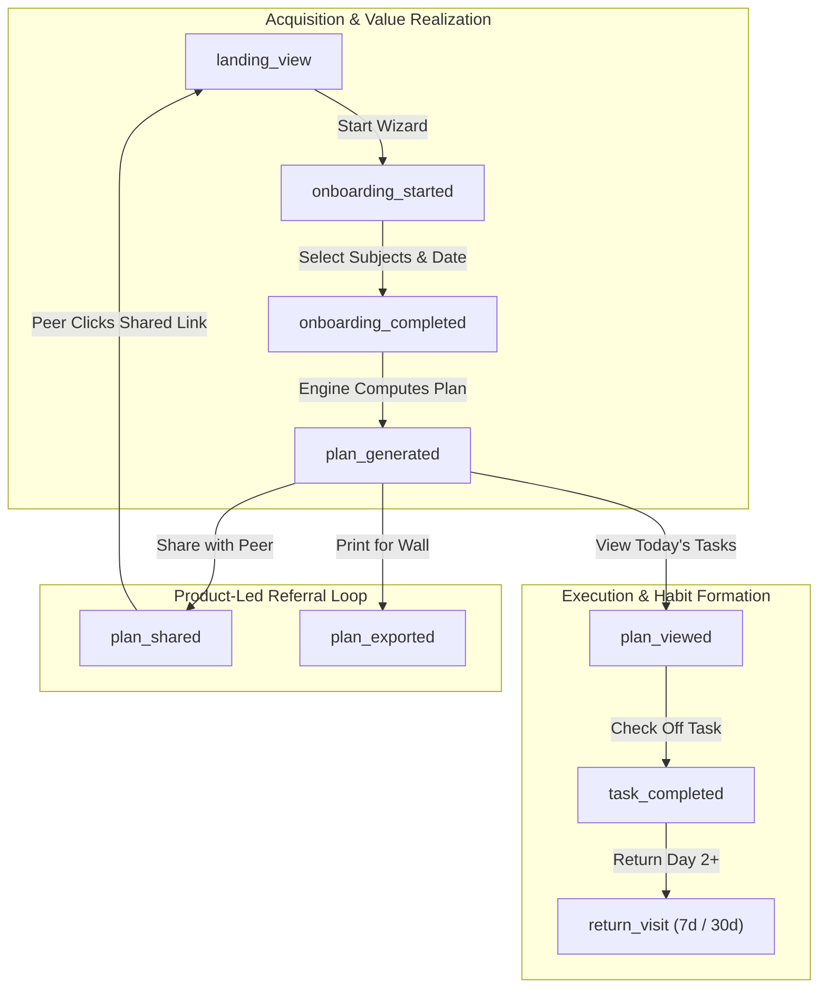

# Mission PlusTwo — Privacy-First Analytics Architecture

## 1. Principles & Regulatory Compliance

Mission PlusTwo is built for high school students preparing for the Kerala Higher Secondary Examinations (DHSE). Student data protection is an absolute ethical and legal mandate.

- **India DPDP Act (Digital Personal Data Protection Act, 2023)** compliant.
- **GDPR & ePrivacy Directive** compliant.
- **Zero Personally Identifiable Information (PII)**: No student names, email addresses, phone numbers, school names, IP addresses, or permanent tracking cookies are ever transmitted to analytics backends.
- **Client-Side Data Retention**: All schedule state, marks, and daily study checklists reside in browser `IndexedDB` / `LocalStorage`.
- **Ad & Signal Isolation**:
  - `allow_google_signals: false`
  - `allow_ad_personalization_signals: false`
  - `restricted_data_processing: true`

---

## 2. Event Taxonomy

All events use standard lower_snake_case naming and are tracked through `src/analytics/tracker.js`:

| Event Name | Trigger Point | Payload Properties | Purpose |
| :--- | :--- | :--- | :--- |
| `landing_view` | User opens application (`/`) | `isFirstVisit: boolean`, `referrer: string` | Top of acquisition funnel |
| `onboarding_started` | Student clicks "Start Planning" or enters wizard | `stream: 'bio' \| 'cs'`, `step: number` | Measures setup intent |
| `onboarding_completed` | Student finishes selecting subjects and target date | `stream: string`, `subjectCount: number`, `hasImprovement: boolean` | Conversion to plan creation |
| `plan_generated` | Scheduling engine successfully generates timetable | `runwayDays: number`, `totalStudyHours: number`, `hasBufferDays: boolean` | Primary product value event |
| `plan_viewed` | Daily dashboard view or calendar navigation | `viewMode: 'daily' \| 'calendar' \| 'syllabus'`, `dayIndex: number` | Measures engagement depth |
| `task_completed` | Student checks off a revision or chapter study slot | `stream: string`, `subject: string`, `isFirstTask: boolean` | Active study execution |
| `plan_shared` | Student shares their timetable link or image | `channel: 'whatsapp' \| 'telegram' \| 'copy_link' \| 'web_share'` | Viral / word-of-mouth loop |
| `plan_exported` | Student prints timetable or exports PDF/ICS | `format: 'print' \| 'pdf' \| 'ics'` | Offline utility conversion |
| `pwa_installed` | Student accepts browser PWA install prompt | `platform: string` | Desktop/homescreen retention |
| `return_visit` | User returns after > 24 hours | `daysSinceFirstVisit: number`, `streak: number` | Long-term retention signal |

---

## 3. Core Conversion & Retention Funnels

### Funnel Metrics Formulations
1. **Initial Conversion Rate**:
   \[
   \text{Setup Conversion} = \frac{\text{Count}(\text{plan\_generated})}{\text{Count}(\text{landing\_view})}
   \]
2. **First-Action Rate**:
   \[
   \text{First Task Rate} = \frac{\text{Count}(\text{task\_completed with isFirstTask=true})}{\text{Count}(\text{plan\_generated})}
   \]
3. **Product-Led Referral Velocity**:
   \[
   \text{Share Rate} = \frac{\text{Count}(\text{plan\_shared})}{\text{Count}(\text{plan\_generated})}
   \]
4. **Day-3 & Day-7 Retention**:
   \[
   \text{D3 Retention} = \frac{\text{Unique Users with return\_visit at } 48\text{--}144\text{ hours}}{\text{Unique Users with plan\_generated}}
   \]

---

## 4. Local On-Device Audit & Diagnostic Mode

To enable developers and privacy advocates to audit tracked events without third-party network access:
1. Every event increments an anonymous counter in local browser storage (`mpt_funnel_counts_v1`).
2. Developers can call `getFunnelStats()` in the browser DevTools console to inspect on-device counts.
3. Every event dispatches a `mpt:analytics` DOM `CustomEvent` locally, enabling real-time UI debugging.
4. When Firebase Analytics is loaded, events emit with `debug_mode: true` to enable live streaming in Firebase DebugView.
