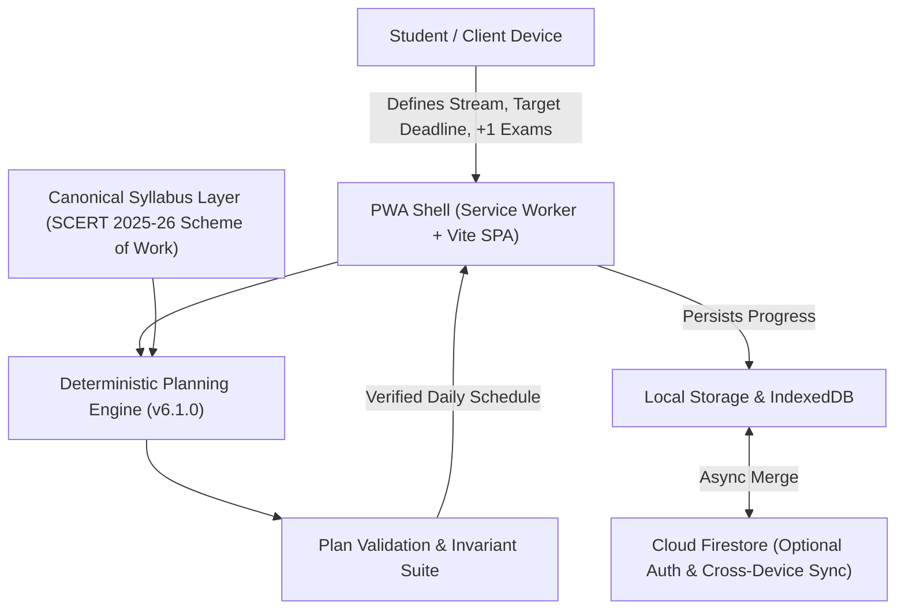
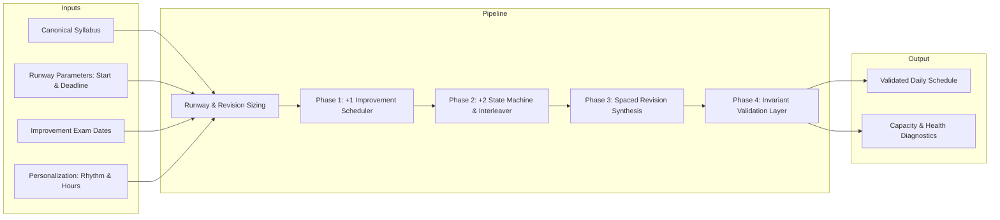
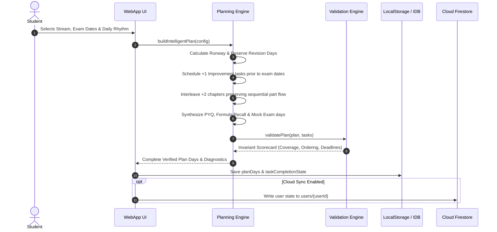

# Mission PlusTwo — System Architecture

## 1. Overview & High-Level System Design

Mission PlusTwo is a client-side progressive web application (PWA) tailored specifically for Kerala Higher Secondary Examination (DHSE) students across Class 11 Improvement and Class 12 (+2) curricula. The system operates under a local-first, offline-capable architecture where all schedule synthesis, dependency resolution, and state updates run deterministically in the client browser with zero mandatory backend roundtrips.



---

## 2. Planning Engine Architecture

The scheduler is structured as a multi-phase, constraint-driven deterministic pipeline:



### 2.1 Core Modules & Responsibilities

1. **`src/engine/planner.js`**:
   - `buildIntelligentPlan(options)`: Unified entry point for schedule generation.
   - `_executeCorePlanAlgorithm(...)`: Core 4-phase scheduling pipeline.
   - `validatePlan(plan, tasks, options)`: Invariant verification assessing duplicates, ordering, deadline bounds, and coverage.
   - `getCanonicalTasks(stream, termScope, ...)`: Extracts active curriculum scope based on student stream and chosen improvement subjects.

2. **`src/engine/migration.js`**:
   - `migrateLegacyUserPlan(storedState)`: Idempotently migrates user profiles, checkmarks, custom notes, and timetable layouts across schema versions (v2 -> v6) without data loss.

3. **`src/data/syllabus-plus-two.js` & `syllabus-plus-one.js`**:
   - Canonical syllabus definitions grounded in the official SCERT Kerala Scheme of Work.
   - Encodes chapter IDs, part divisions, estimated completion durations (minutes), term boundaries, and prerequisite links.

---

## 3. Data Flow & State Lifecycle



---

## 4. Canonical Syllabus & Task Model

Every study unit represents an atomic syllabus part conforming to JSON schema specifications (`src/data/syllabus-schema.json`):

```json
{
  "id": "P2_PHY_01_P1",
  "grade": "+2",
  "subject": "Physics",
  "chapNumber": 1,
  "chapId": "P2_PHY_01",
  "chapterName": "Electric Charges and Fields",
  "part": 1,
  "totalParts": 3,
  "topicTitle": "Coulomb's Law, Electric Field & Dipole Moments",
  "term": 1,
  "estimatedMinutes": 60,
  "prerequisiteId": null
}
```

For parts with `part > 1`, `prerequisiteId` links strictly to `P{grade}_{SUB}_{chapNumber}_P{part-1}`.

---

## 5. Deployment & Runtime Architecture

- **Bundle Tooling**: Built with Vite 8 and Tailwind CSS 4, generating optimized ES modules with code splitting.
- **PWA Service Worker**: Cache-first strategy for static assets and local syllabus databases (`sw.js`). Installs as a standalone WebAPK on Android and Progressive Web App on desktop/iOS.
- **Persistence**: Multi-tiered offline storage:
  - Fast memory state during runtime.
  - Synchronous LocalStorage serialization for immediate recovery.
  - Asynchronous Cloud Firestore sync under `/users/{userId}` for authenticated cross-device sync.

---

## 6. Ecosystem Expansion & Curriculum Adapter Pattern

The core planning engine in `src/engine/planner.js` is architected with a strict separation between the **Constraint-Propagation Scheduling Engine** and the **Curriculum Data Layer**:

```
+-----------------------------------------------------------+
|              Core Scheduling Engine (planner.js)          |
|  - Dependency Topological Sort   - Workload Variance Clamping
|  - Pacing Capacity Balancer      - Revision Buffer Calculator
+-----------------------------+-----------------------------+
                              |
              +---------------+---------------+
              |                               |
              v                               v
+-----------------------------+ +-----------------------------+
|    Kerala DHSE Adapter      | |   Generic Curriculum Adapter |
|  - SCERT Science Syllabus   | |  - CBSE Class 12            |
|  - +1 Improvement Weaving   | |  - Karnataka PUC / TN HSE   |
+-----------------------------+ +-----------------------------+
```

### Creating a Custom Curriculum Adapter
Any state board or curriculum can integrate by supplying an array of task objects matching the standard schema to `buildIntelligentPlan`:

```javascript
import { buildIntelligentPlan } from './src/engine/planner.js';

const customCurriculumTasks = [
  {
    id: "CBSE_12_MTH_01_P1",
    grade: "12",
    subject: "Mathematics",
    chapNumber: 1,
    chapterName: "Relations and Functions",
    part: 1,
    totalParts: 2,
    topicTitle: "Types of Relations and Equivalence",
    estimatedMinutes: 60,
    prerequisiteId: null
  },
  // ...additional curriculum units
];

const customSchedule = buildIntelligentPlan({
  tasks: customCurriculumTasks,
  startDateStr: "2026-10-01",
  endDateStr: "2026-12-15",
  revisionDaysCount: 7
});
```

This permits other educational communities to leverage Mission PlusTwo's verified, bug-free scheduling engine without modifying core codebase algorithms.

